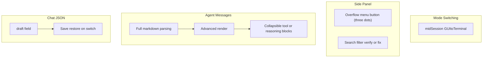

# GUI Forward Focus — Unchecked Features

After your edit, every `- [ ]` line in [bookworm/gui/feature-list.md](bookworm/gui/feature-list.md) is listed below, grouped by section. These are the features to prioritize next.

---

## 1. Mode Switching

**Switch between GUI and terminal mid-session** (line 14)

- Today: mode is chosen once at launch via CLI (`bookworm` vs `bookworm gui` / `bookworm terminal` in [bookworm/cli.py](bookworm/cli.py)).
- Goal: allow switching modes without restarting the app — e.g. a menu action or command that hands off the session from GUI to terminal (or vice versa) while preserving context.

> Note: line 7 still says GUI is the default; you recently changed CLI default to terminal on another branch. Worth aligning the doc when you next edit it.

---

## 2. Side Panel

### Chat Operations

**Overflow menu button (three dots) → context menu (rename / delete)** (line 37)

- Goal: each chat row gets a visible overflow menu button (three dots) that opens rename/delete, matching the mockup UX.
- Current state: rename/delete **do** work via **right-click** context menu in [side_panel_controller.py](bookworm/gui/controllers/side_panel_controller.py) (`show_context_menu`). The gap is the dedicated overflow menu button (three dots) on `chat_item.ui`, not the menu logic itself.

### Search

**Filtering logic** (line 44)

- Goal: real-time chat list filtering as the user types in the search box.
- Current state: **likely already implemented** in [side_panel_controller.py](bookworm/gui/controllers/side_panel_controller.py) (`search_filter`, debounced `apply_search_filter`, name substring match in `apply_sorting_and_filtering`). If it works in the running app, this checkbox may be stale and can be ticked; if not, debug why the wired logic doesn’t surface in the UI.

---

## 3. Main Conversation Panel — Agent Message

Three related rendering gaps under **Agent Message `DOING`**:

### **Markdown parsing from raw LLM output** (line 78)

- Goal: reliably turn raw agent markdown into structured UI widgets.
- Current state: [chat_controller.py](bookworm/gui/controllers/chat_controller.py) has a hand-rolled `create_markdown_widget()` that handles a **subset** of markdown (headings, lists, code fences line-by-line). Full/common markdown (nested lists, links, tables, inline code, blockquotes) is not covered. Agent responses are still **simulated** (`simulate_agent_response`), not from the real LLM.

### **Advanced format render** (line 79)

- Goal: richer rendering beyond basic line parsing — e.g. syntax-highlighted code blocks, inline formatting (`**bold**`, `` `code` ``), links, tables, blockquotes.
- Builds on top of line 78; likely needs a proper markdown library (e.g. `markdown` + HTML in `QTextBrowser`, or a Qt-native renderer) instead of the current per-line `QLabel` approach.

### **Collapsible sections for tool execution and thinking/reasoning** (line 80)

- Goal: when the agent runs tools or emits reasoning/thinking blocks, show them in expandable/collapsible UI sections (similar to ChatGPT tool calls or chain-of-thought disclosure).
- Depends on real agent integration: the GUI must receive structured tool-call / reasoning events, not just final text. Copy/Redo (already done) operate on raw markdown today.

---

## 4. Data Management — Chat Storage

Parent item **Structured JSON schema** (line 97) is now checked because `draft` persistence is implemented:

### **`draft` field** (lines 102–105)

Each chat JSON file under `.bookworm/chats/` now includes a draft input field:

| Sub-item | Behavior |
|---|---|
| Store draft text (line 103) | Text in the chat input field is saved as part of the chat’s persisted state |
| Restore on chat switch (line 104) | Switching chats saves the current draft to the previous chat’s JSON and loads the next chat’s draft into the input field |
| Empty default (line 105) | Use `""` when no draft exists yet |

- Current state: [chat.py](bookworm/gui/models/chat.py) serializes `draft`, defaults missing values to `""`, and the GUI saves/restores draft text when switching chats.

---

## Summary map

**Count:** 4 top-level unchecked bullets + 3 nested `draft` bullets = **7 distinct feature areas** (search may be verify-and-tick only).

---

## Suggested priority (optional)

If you want an order that unblocks the most user-visible value:

1. **Draft persistence** — small schema + controller change; improves daily UX immediately
2. **Overflow menu button (three dots)** — UI-only; reuses existing rename/delete handlers
3. **Real markdown + advanced render** — needed before agent backend wiring pays off visually
4. **Collapsible tool/reasoning sections** — needs real agent streaming/events
5. **Mid-session mode switch** — architectural; lowest urgency unless explicitly required

No code changes in this step — this is the backlog read from your edited feature list.
