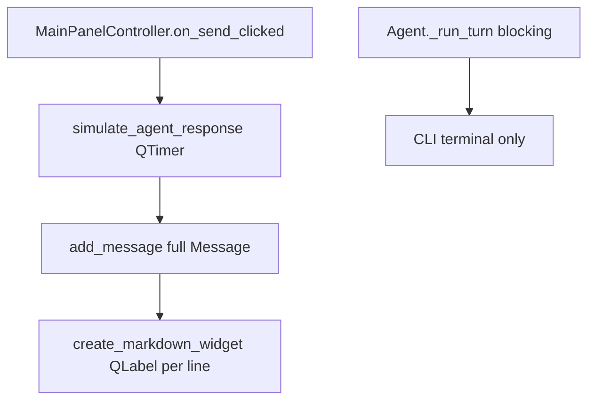
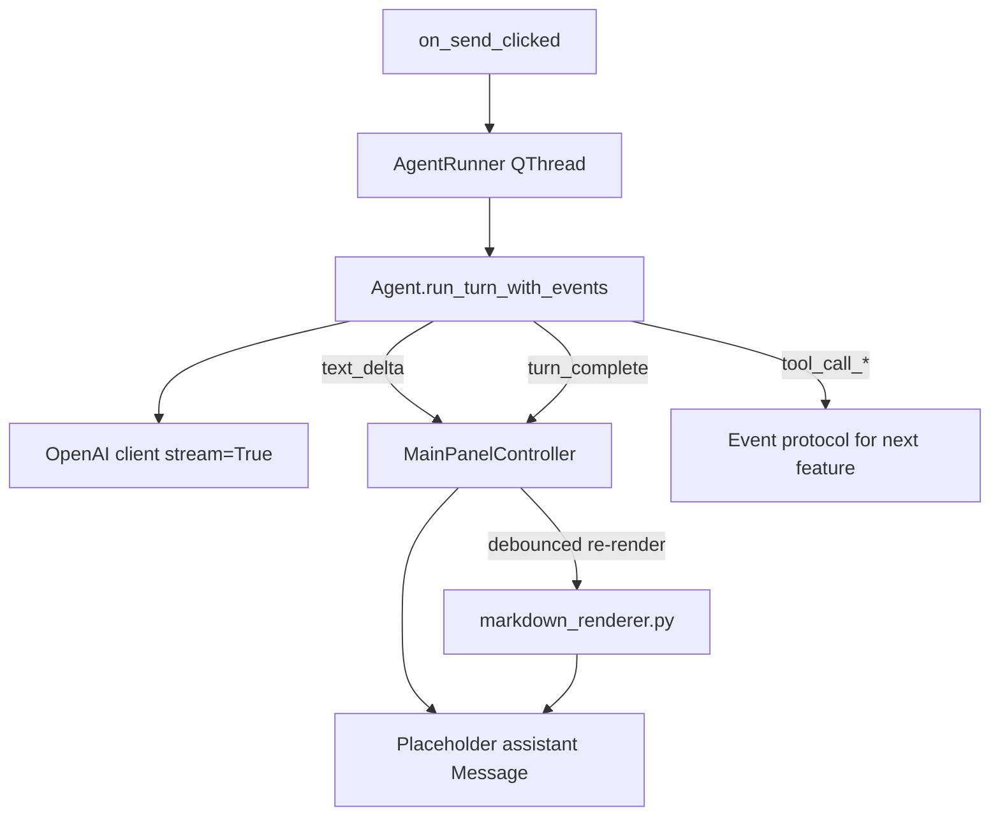

# Real Markdown + Advanced Render + Agent Streaming

## User insight (plan revision)

Collapsible tool/reasoning sections (next feature in [gui_remaining_features_73744521.plan.md](.cursor/plans/gui_remaining_features_73744521.plan.md)) need **structured agent events**, not just pretty static markdown. The GUI also still uses `simulate_agent_response()` — there is no real Agent wired yet.

**Revised scope:** this work delivers three things together:

1. **Proper markdown rendering** (replace per-line `QLabel` hack)
2. **Real agent backend in the GUI** (replace simulation)
3. **Streaming assistant text** (tokens appear live; markdown re-renders as content grows)

Collapsible tool/reasoning UI stays a **follow-up task**, but we define the **event protocol now** so that feature plugs in without another Agent refactor.

---

## Two kinds of “streaming” (don’t conflate them)

| Kind | What it is | Needed for |
|---|---|---|
| **Text streaming** | Assistant reply text arrives token-by-token; bubble grows live | Markdown UX, “Thinking…” feel |
| **Structured events** | Discrete events: `tool_call_started`, `tool_result`, `reasoning_delta`, etc. | Collapsible tool/reasoning sections (next feature) |

This plan implements **text streaming + event hooks**. Collapsible widgets consume the hooks in the next task.

---

## What you have today



- [`bookworm/gui/controllers/main_panel_controller.py`](bookworm/gui/controllers/main_panel_controller.py): hand-rolled markdown, simulated response, TODO comment at line 309
- [`bookworm/agent.py`](bookworm/agent.py): blocking `_run_turn()` loop with tool calls; prints final text to terminal only; no streaming, no callbacks
- [`bookworm/gui/models/message.py`](bookworm/gui/models/message.py): `content` + `tool_calls[]` already in schema (persistence-ready)

---

## Target architecture



---

## Phase 1 — Markdown renderer (foundation)

Unchanged core from prior plan; add **update** API for streaming.

Create [`bookworm/gui/markdown_renderer.py`](bookworm/gui/markdown_renderer.py):

| Function | Purpose |
|---|---|
| `render_markdown_html(content, colors) -> str` | Pure Python; unit-testable |
| `create_markdown_widget(content, colors) -> QTextBrowser` | Initial widget |
| `update_markdown_widget(browser, content, colors) -> None` | Re-set HTML + adjust height (streaming) |

**Stack:** `markdown` + `pygments` → themed HTML → read-only `QTextBrowser`

- Extensions: `fenced_code`, `tables`, `nl2br`, `sane_lists`, `codehilite`
- No raw HTML passthrough from LLM output
- Auto-height inside parent `QScrollArea` via `documentSizeChanged`
- Copy/Redo still use raw `message.content` (unchanged)

**New dependencies:** `markdown`, `pygments` in [`pyproject.toml`](pyproject.toml)

---

## Phase 2 — Agent event protocol

Refactor [`bookworm/agent.py`](bookworm/agent.py) so the turn loop can report progress without printing to stdout.

Introduce a small protocol (dataclass or TypedDict callbacks):

```python
# bookworm/agent_events.py (new)
on_text_delta(str)           # append assistant text chunk
on_tool_call_started(name, args, call_id)
on_tool_result(call_id, output)
on_reasoning_delta(str)      # optional; OpenRouter reasoning if present
on_turn_complete(final_content: str, tool_calls: list)
on_error(str)
```

Changes to `_run_turn`:
- Accept optional `event_handler` callback bundle
- Use `stream=True` on `chat.completions.create` for the **final** assistant message (non-tool leg)
- When model returns `tool_calls`, emit `on_tool_call_started` / run tools / emit `on_tool_result`, then loop (same as today, but observable)
- Keep existing CLI `run()` working by passing a handler that prints deltas or only prints final text

**Note:** Tool-call legs may not stream cleanly on all providers; it is OK if tool-planning steps arrive as whole messages while the **final user-facing answer** streams token-by-token.

---

## Phase 3 — GUI AgentRunner + wire main panel

New [`bookworm/gui/agent_runner.py`](bookworm/gui/agent_runner.py):

- `QObject` with Qt signals mirroring the event protocol
- Runs `Agent.run_turn_with_events(...)` in a `QThread` worker (never block UI thread)
- Builds conversation history from `MainPanelController.get_message_dicts()` (+ system prompt from [`bookworm/prompts.py`](bookworm/prompts.py))
- Cancelling / send-while-busy: disable send button (already partially done via `is_processing`)

Wire [`bookworm/gui/controllers/app_controller.py`](bookworm/gui/controllers/app_controller.py) or `MainPanelController`:

1. Remove `simulate_agent_response`
2. On send: append user message → create **empty/partial assistant placeholder** → start `AgentRunner`
3. On `text_delta`: append to `message.content`, call debounced `update_markdown_widget`
4. On `turn_complete`: finalize message, set `tool_calls` on `Message`, persist via existing `messages_changed` / `ChatStore`
5. On `tool_call_*`: store on message / emit side-channel signal for future collapsible UI (no widget yet — log or stash in `message.tool_calls`)

**Streaming re-render performance:**
- Debounce markdown HTML regen (~50–100 ms) during token arrival
- Full render on `turn_complete` and theme change
- Acceptable for v1; optimize later if needed

---

## Phase 4 — Tests and docs

**Tests:**
- [`tests/test_markdown_renderer.py`](tests/test_markdown_renderer.py): headings, bold, fenced code + Pygments classes, tables, links
- [`tests/test_agent_events.py`](tests/test_agent_events.py): mock LLM client; verify handler called for tool loop + text deltas (pattern similar to existing CLI tests)

**Docs:**
- Tick feature-list lines 79–80 (markdown + advanced render)
- Add note that streaming is implemented; collapsible UI (line 81) is next and will use the same event protocol
- Update [`bookworm/gui/design.md`](bookworm/gui/design.md) agent status / message rendering sections

---

## What stays out of scope (next feature)

- **Collapsible tool/reasoning widgets** — UI only; events already emitted in Phase 2–3
- **Mid-session GUI ↔ terminal switch**
- **Streaming reasoning UI** — hook exists (`on_reasoning_delta`); widget comes with collapsible sections

---

## Suggested commit order

1. Markdown renderer + tests (still works with simulate fixture as static message)
2. Agent event protocol + CLI compatibility tests
3. AgentRunner + replace simulation + streaming UI
4. Docs + rich sample response for manual QA

---

## Risk notes

- **Thread safety:** Agent runs off UI thread; only Qt signals touch widgets
- **Provider differences:** Ollama vs OpenRouter streaming/reasoning shape may differ — guard optional fields
- **Partial markdown during stream:** Re-rendering incomplete fences/tables may flicker; debounce helps; final render on complete fixes layout
- **Legacy:** [`bookworm/gui/controllers/chat_controller.py`](bookworm/gui/controllers/chat_controller.py) is unused — ignore or delete separately
