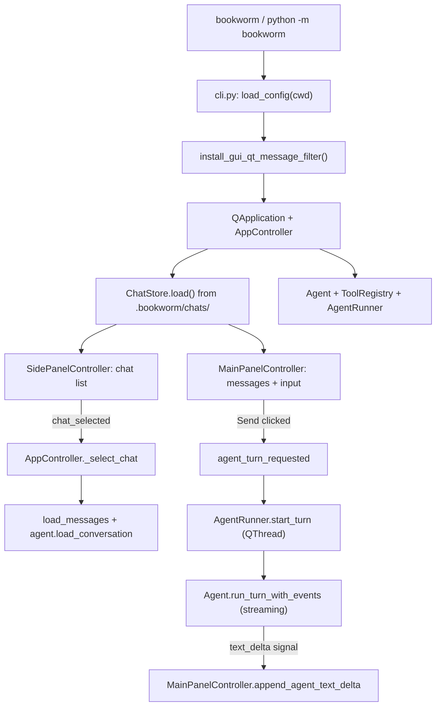

# GUI branch walkthrough: `feat/user-interface-enhanced` vs `main`

This document explains how the GUI feature branch fits together. It is based on a comparison of `**main**` and `**feat/user-interface-enhanced**` (~52 files changed, ~5,400 lines added).

Use this when debugging: start from the flow diagram, then open the file named in the step that misbehaves.

---

## What changed at a glance


| Area        | On `main`                               | On `feat/user-interface-enhanced`                                                    |
| ----------- | --------------------------------------- | ------------------------------------------------------------------------------------ |
| Entry       | Terminal agent only (`bookworm` → REPL) | **GUI is default** (`bookworm` opens PySide6 window); `bookworm terminal` keeps CLI  |
| UI          | None                                    | Full PySide6 app: side panel (chats) + main panel (conversation)                     |
| Persistence | None in GUI                             | Chats saved as JSON under `**<project>/.bookworm/chats/`**                           |
| Agent       | Synchronous terminal loop               | Same `Agent` class, but GUI runs turns on a **background thread** with **streaming** |
| Markdown    | N/A                                     | Assistant messages rendered as themed HTML in read-only `QTextEdit` widgets          |
| Tools       | `ask_user` blocks in terminal           | `ask_user` routed through `**AskUserBridge`** (modal Qt dialog)                      |


---

## Startup flow (follow this first)




**Files involved**

1. `bookworm/cli.py` — subcommands, creates Qt app, shows window.
2. `bookworm/gui/controllers/app_controller.py` — wires everything; owns `Agent`, `ChatStore`, both panel controllers, `AgentRunner`.
3. `bookworm/gui/controllers/side_panel_controller.py` — chat list, search, sort, rename/delete, theme toggle.
4. `bookworm/gui/controllers/main_panel_controller.py` — message bubbles, markdown, send button, streaming UI.
5. `bookworm/gui/agent_runner.py` — runs agent off the UI thread; emits Qt signals.

---

## MVC layout (GUI package)

The GUI follows **Model – View – Controller**. Views are Qt Designer `.ui` files; controllers use `findChild()` to bind widgets.

```
bookworm/gui/
├── models/           # Data: Chat, Message, ChatStore (JSON on disk)
├── views/            # .ui layouts + generated ui_*.py (do not hand-edit ui_*.py)
│   ├── window/     # QMainWindow shell + splitter
│   ├── panel/      # side_panel.ui, main_panel.ui
│   └── widget/     # chat_item.ui, message_bubble.ui (mostly legacy/unused for bubbles)
├── controllers/    # Behaviour
│   ├── app_controller.py
│   ├── side_panel_controller.py
│   └── main_panel_controller.py
├── agent_runner.py   # Background agent thread
├── ask_user_bridge.py
├── markdown_renderer.py
├── themes.py
├── config.py         # GUIConfig (window size, theme)
└── qt_message_filter.py
```

**Rule of thumb**

- **Model** = what is stored (`Chat`, `Message`, files in `.bookworm/chats/`).
- **View** = static layout from Designer.
- **Controller** = connects signals, updates widgets, talks to `Agent` / `ChatStore`.

---

## Data model and persistence

### Chat JSON schema

Each chat is one file: `<working_dir>/.bookworm/chats/<uuid>.json`

```json
{
  "id": "...",
  "name": "New Chat 11:30 AM 22/6/2026",
  "created_at": "...",
  "updated_at": "...",
  "draft": "unsent text in the input box",
  "messages": [
    {
      "role": "user",
      "content": "...",
      "timestamp": "...",
      "tool_calls": []
    }
  ]
}
```

**Key files:** `bookworm/gui/models/chat.py`, `chat_store.py`, `message.py`

### When data is saved


| Event                  | What happens                                                                          |
| ---------------------- | ------------------------------------------------------------------------------------- |
| User sends a message   | `MainPanelController` emits `messages_changed` → `AppController._save_current_chat()` |
| Agent finishes / fails | Same (streaming message finalized)                                                    |
| Draft typed in input   | `draft_changed` → save                                                                |
| Switch chat            | Save current chat, then load selected chat                                            |
| Rename / delete chat   | `SidePanelController` signal → `AppController` updates `ChatStore`                    |


`_loading_conversation` flag prevents saving empty state while a chat is being loaded.

---

## Side panel vs main panel

### Side panel (`SidePanelController`)

- Lists chats grouped by date (Today, Yesterday, …).
- **Select chat** → emits `chat_selected` (click filter on row + `QListWidget.itemClicked`).
- **New chat** → `chat_created`.
- **Rename** → inline `QLineEdit` (double-click row or overflow menu).
- **Delete** → overflow menu (⋯ button).
- **Theme toggle** → `theme_toggle_requested` → `AppController.on_theme_toggle`.
- `**set_active_chat_id`** only restyles the active row (accent border); it does **not** rebuild the whole list (this avoids Qt lifecycle warnings on click).

### Main panel (`MainPanelController`)

- **User messages:** right-aligned `QLabel` bubbles.
- **Assistant messages:** `QTextEdit` subclass via `markdown_renderer.create_markdown_view()`; HTML from markdown.
- **Send flow:**
  1. `on_send_clicked` → `add_message(user)` → `agent_turn_requested.emit()`
  2. `AppController._on_agent_turn_requested` → sync agent history → `AgentRunner.start_turn`
  3. Streaming deltas update a placeholder assistant `Message` (`_streaming_message`).
  4. On complete: `complete_streaming_agent_turn(content, tool_calls)` persists tool metadata in the message dict.

**Layout refresh:** `_do_refresh_message_layouts` recomputes bubble widths and markdown heights after resize/show. Uses debounced timers and `_suppress_layout_refresh` during bulk `load_messages()`.

---

## Agent integration (backend changes)

The same `bookworm/agent.py` class serves **both** CLI and GUI, with new methods added on the branch.

### `load_conversation(chat_messages)`

Rebuilds `self.messages` from GUI JSON when switching chats.

Important detail: GUI stores `tool_calls` as flat objects `{id, name, arguments, result}`. The API expects nested `{id, type, function: {name, arguments}}`. `**_api_tool_calls_from_gui()`** converts on load, and tool **results** are replayed as separate `{role: tool, ...}` messages. Without this, the **second user message in a chat returns HTTP 400**.

### `run_turn_with_events(event_handler)`

- **CLI** (`agent.run()`): calls with `event_handler=None` → non-streaming path.
- **GUI** (`AgentRunner`): passes `TurnEventHandler` → **streaming** path (`stream=True`).

Loop per turn:

1. Stream LLM response → emit `on_text_delta` for each content chunk.
2. If model requests tools → emit `on_tool_call_started`, run tool, emit `on_tool_result`, append to history, loop again.
3. When model returns text only → emit `on_turn_complete`, return.

**Event types:** `bookworm/agent_events.py` (`TurnEventHandler` dataclass).

### `ask_user` in GUI

`create_tool_registry(config, ask_user_fn=...)` accepts an optional callback.

- Terminal: default blocking `input()`.
- GUI: `AskUserBridge.ask` shows `QInputDialog` on the main window (must run on UI thread; tool runs inside worker thread — bridge uses Qt mechanisms to stay safe).

---

## Threading model (why things feel split)


| Thread             | Runs                                                                   |
| ------------------ | ---------------------------------------------------------------------- |
| **Qt main (UI)**   | All widgets, signals, `MainPanelController`, user input                |
| **QThread worker** | `Agent.run_turn_with_events`, LLM HTTP, tools (`bash`, `read_file`, …) |


`AgentRunner` connects worker signals to main-panel slots:

```
text_delta          → append_agent_text_delta
tool_call_started   → record_agent_tool_call_started
tool_result         → record_agent_tool_result
turn_complete       → complete_streaming_agent_turn
error (failed)      → fail_agent_turn
```

Never update Qt widgets directly from the worker thread — only via signals.

---

## Markdown rendering

**File:** `bookworm/gui/markdown_renderer.py`

- Converts markdown → HTML (Python `markdown` + Pygments for code blocks).
- `_normalize_bullet_markers`: turns leading `*`  lines into `-`  so lists render consistently.
- `update_markdown_widget`: deferred `setHtml` + auto-height via `documentSizeChanged`.
- `_active_markdown_views`: stale timers after `clear_messages()` are ignored.

**Prompt nudge:** `bookworm/prompts.py` adds `RESPONSE FORMATTING` — ask model to use `-` for bullets.

---

## Themes

**File:** `bookworm/gui/themes.py`

- `build_stylesheet(theme)` — global Qt stylesheet for the app.
- `get_colors(theme)` — dict used by controllers for inline bubble/markdown CSS.
- Toggle in side panel → both controllers' `apply_theme()` rebuild styled widgets.

---

## Qt benign warning log

**File:** `bookworm/gui/qt_message_filter.py`

Known-harmless Qt warnings (e.g. `QWidget::mapFrom(): parent must be in parent hierarchy`) are:

- **Hidden from stderr** (so the terminal stays readable).
- **Appended to** `debug/qt-benign.log` in the BookWorm-Engineer repo (gitignored).

This warning often appears when coordinate mapping runs during widget teardown or rapid chat switching. Side-panel highlight-only updates reduced how often it fires; the filter keeps a paper trail for agents/debugging.

---

## Tests added on the branch


| Test file                         | Covers                                          |
| --------------------------------- | ----------------------------------------------- |
| `tests/test_gui.py`               | Basic GUI imports / smoke                       |
| `tests/test_chat_store.py`        | Chat JSON load/save, draft field                |
| `tests/test_markdown_renderer.py` | HTML output, bullets, code blocks               |
| `tests/test_agent_events.py`      | Streaming/event handler behaviour               |
| `tests/test_agent_gui.py`         | `load_conversation` + GUI tool_calls conversion |


Run: `pytest tests/test_markdown_renderer.py tests/test_agent_gui.py tests/test_chat_store.py -q`

---

## Commit timeline (newest first, abbreviated)

Recent functional commits on the branch:

1. Benign Qt log → `debug/qt-benign.log`
2. Remove debug session instrumentation; GUI message filter in CLI
3. Tool-call format conversion, markdown bullets, batch `load_messages`, layout refresh fixes
4. Markdown rendering + streaming agent events
5. Real agent wired to GUI (`AgentRunner`)
6. Chat rename via inline edit, overflow menu
7. Draft persistence in chat JSON
8. Thread → Chat rename, MVC refactor, side/main panel naming
9. Initial GUI shell, themes, PySide6 fixes, `bookworm` defaulting to GUI

Full list: `git log main..feat/user-interface-enhanced --oneline`

---

## Debugging cheat sheet

### “Second message in a chat fails / 400 from API”

→ `agent.load_conversation` / `_api_tool_calls_from_gui` in `bookworm/agent.py`  
→ Inspect saved JSON in `.bookworm/chats/` for `tool_calls` shape.

### “Assistant text empty while thinking”

→ Normal during tool loops (no text deltas until model speaks).  
→ Check status bar (“Running tool: …”) and `AgentRunner.is_running()`.

### “UI frozen”

→ Worker may be in long tool/bash/LLM call — not always a deadlock.  
→ If permanently stuck, check worker `failed` signal path in `agent_runner.py`.

### “Markdown looks wrong / literal asterisks”

→ `markdown_renderer._normalize_bullet_markers` + model prompt.  
→ Old messages keep old text until re-sent or re-rendered.

### “User bubble width wrong on startup or resize”

→ `MainPanelController.refresh_message_layouts` / `_message_content_max_width`.  
→ `cli.py` calls `refresh_message_layouts` once after `window.show()`.

### “Chat switch glitches / mapFrom warning”

→ Side panel: `set_active_chat_id` vs `update_chat_display`.  
→ Main panel: `load_messages` + `_suppress_layout_refresh`.  
→ See `debug/qt-benign.log` for captured warnings.

### “ask_user dialog doesn’t appear”

→ `AskUserBridge` + `create_tool_registry(..., ask_user_fn=...)` in `app_controller.py`.

---

## One-page mental model

1. `**AppController`** is the hub: disk ↔ panels ↔ agent.
2. **Side panel** picks *which chat*; **main panel** shows *messages* and *input*.
3. `**ChatStore`** is the source of truth on disk; panels are projections.
4. `**Agent`** is the brain; `**AgentRunner`** runs it without blocking Qt.
5. **Signals** are the glue — grep for `.connect(` in `app_controller.py` to see every link.

When lost, open `app_controller.py` and trace from the user action’s signal name backward.

---

*Generated from branch comparison `main...feat/user-interface-enhanced`. Update this doc if major wiring changes.*